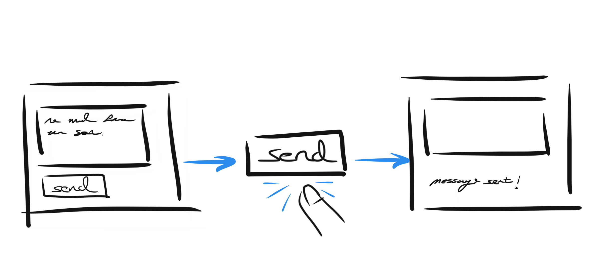
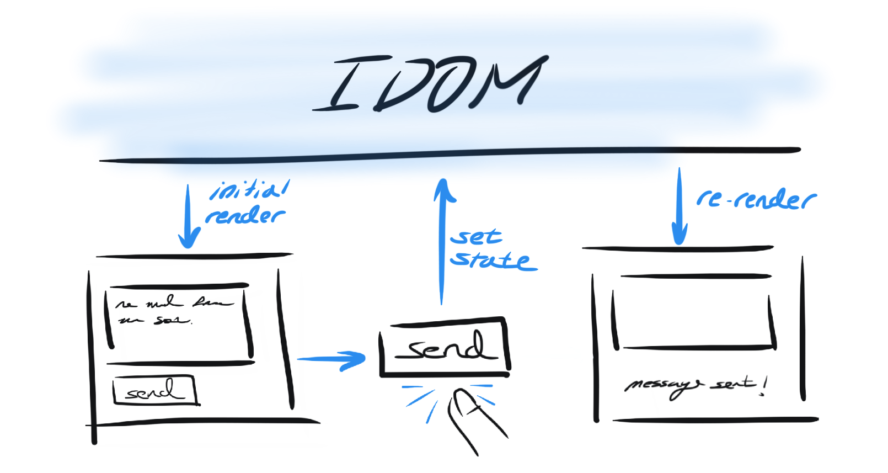

State as a Snapshot
===================

When you watch the user interfaces you build change as you interact with them, it's easy
to imagining that they do so because there's some bit of code that modifies the relevant
parts of the view directly. For example, you may think that when a user clicks a "Send"
button, there's code which reaches into the view and adds some text saying "Message
sent!":

IDOM works a bit differently though - user interactions cause event handlers to
:ref:`"set state" <Introduction to use_state>` triggering IDOM to re-render a new
version of the view rather then mutating the existing one.

Given this, when IDOM "renders" something, it's as if IDOM has taken a snapshot of the
UI where all the event handlers, local variables and the view itself were calculated
using what state was present at the time of that render. Then, when user iteractions
trigger state setters, IDOM is made away of the newly set state and schedules a
re-render. When this subsequent renders occurs it performs all the same calculations as
before, but with this new state.

As we've :ref:`already seen <When Variables Aren't Enough>`, state variables are not
like normal variables. Instead, they live outside your components and are managed by
IDOM. When a component is rendered, IDOM provides the component a snapshot of the state
in that exact moment. As a result, the view returned by that component is itself a
snapshot of the UI at that time.

Investigating State Snapshots
-----------------------------

Let's experiment with some potentially less intuitive behaviors of state to see why we
should think about it with respect to these "snapshots" in time. Take a look at the
example below and try to guess how it will behave. **What will the count be after you
click the "Increment" button?**

.. idom:: _examples/set_counter_3_times

Despite the fact that we called ``set_count(count + 1)`` three times, the count only
increments by ``1``! This is perhaps a surprising result, but let's break what's
happening inside the event handler to see why this is happening:

.. code-block::

    set_count(count + 1)
    set_count(count + 1)
    set_count(count + 1)

On the initial render of your ``Counter`` the ``number`` variable is ``0``. So we ought
to be able to substitute ``number`` with ``0`` everywhere it's referenced within the
component. Since that includes the event handler too we should be able to rewrite the
three lines above as:

.. code-block::

    set_count(0 + 1)
    set_count(0 + 1)
    set_count(0 + 1)

Even though, we called ``set_count`` three times, every time we were actually just
doing ``set_count(1)`` three times. Only after the event handler returns will IDOM
actually perform the next render where count is ``1``. When it does, ``number`` will be
``1`` and we'll be able to perform the same subtitution as before to see what the next
number will be after we click "Increment":

.. code-block::

    set_count(1 + 1)
    set_count(1 + 1)
    set_count(1 + 1)
