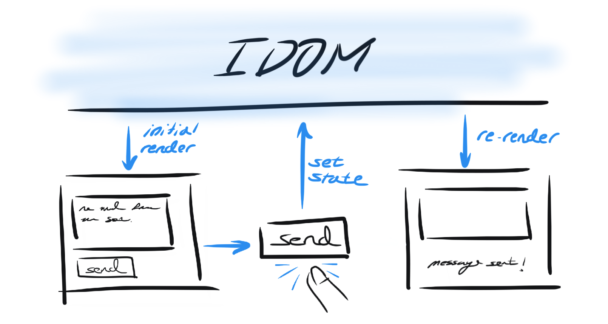

State as a Snapshot
===================

When you watch the user interfaces you build change as you interact with them, it's easy
to imagining that they do so because there's some bit of code that modifies the relevant
parts of the view directly. As an illustration, you may think that when a user clicks a
"Send" button, there's code which reaches into the view and adds some text saying
"Message sent!":

.. image:: _static/direct-state-change.png

IDOM works a bit differently though - user interactions cause event handlers to
:ref:`"set state" <Introduction to use_state>` triggering IDOM to re-render a new
version of the view rather then mutating the existing one.

Given this, when IDOM "renders" something, it's as if IDOM has taken a snapshot of the
UI where all the event handlers, local variables and the view itself were calculated
using what state was present at the time of that render. Then, when user iteractions
trigger state setters, IDOM is made away of the newly set state and schedules a
re-render. When this subsequent renders occurs it performs all the same calculations as
before, but with this new state.

As we've :ref:`already seen <When Variables Aren't Enough>`, state variables are not
like normal variables. Instead, they live outside your components and are managed by
IDOM. When a component is rendered, IDOM provides the component a snapshot of the state
in that exact moment. As a result, the view returned by that component is itself a
snapshot of the UI at that time.

Setting State Triggers Renders
------------------------------

Setting state does not impact the current render, instead it schedules a re-render. It's
only in this subsequent render that changes to state take effect. As a result, setting
state more than once in the context of the same render will not cause those changes to
compound. This makes it easier to reason about how your UI will react to user
interactions because state does not change until the next render.

Let's experiment with this behaviors of state to see why we should think about it with
respect to these "snapshots" in time. Take a look at the example below and try to guess
how it will behave. **What will the count be after you click the "Increment" button?**

.. idom:: _examples/set_counter_3_times

Despite the fact that we called ``set_count(count + 1)`` three times, the count only
increments by ``1``! This is perhaps a surprising result, but let's break what's
happening inside the event handler to see why this is happening:

.. code-block::

    set_count(count + 1)
    set_count(count + 1)
    set_count(count + 1)

On the initial render of your ``Counter`` the ``number`` variable is ``0``. Because we
know that state variables do not change until the next render we ought to be able to
substitute ``number`` with ``0`` everywhere it's referenced within the component until
then. That includes the event handler too we should be able to rewrite the three lines
above as:

.. code-block::

    set_count(0 + 1)
    set_count(0 + 1)
    set_count(0 + 1)

Even though, we called ``set_count`` three times with what might have seemed like
different values, every time we were actually just doing ``set_count(1)`` on each call.
Only after the event handler returns will IDOM actually perform the next render where
count is ``1``. When it does, ``number`` will be ``1`` and we'll be able to perform the
same subtitution as before to see what the next number will be after we click
"Increment":

.. code-block::

    set_count(1 + 1)
    set_count(1 + 1)
    set_count(1 + 1)

State And Delayed Reactions
---------------------------

Given what we :ref:`learned above <setting state triggers renders>`, we ought to be able
to reason about what should happen in the example below. What will be printed when the
"Increment" button is clicked?

.. idom:: _examples/print_count_after_set

If we use the same subtitution trick we saw before, we can rewrite these lines:

.. code-block::

    set_number(number + 5)
    print(number)

Using the value of ``number`` in the initial render which is ``0``:

.. code-block::

    set_number(0 + 5)
    print(0)

Thus when we click the button we should expect that the next render will show ``5``, but
we will ``print`` the number ``0`` instead. The next time we click the view will show
``10`` and the printout will be ``5``. In this sense the print statement, because it
lives within the prior snapshot, trails what is displayed in the next render.

What if we slightly modify this example, by introducing a delay between when we call
``set_number`` and when we print? Will this behavior remain the same? To add this delay
we'll use an :ref:`async event handler` and :func:`~asyncio.sleep` for some time:

.. idom:: _examples/delayed_print_after_set

Even though the render completed before the print statement took place, the behavior
remained the same! Despite the fact that the next render took place before the print
statement did, the print statement still relies on the state snapshot from the initial
render. Thus we can continue to use our substitution trick to analyze what's happening:

.. code-block::

    set_number(0 + 5)
    print("about to print...")
    await asyncio.sleep(3)
    print(0)

This property of state, that it remains static within the context of particular render,
while unintuitive at first, is actually an important tool for preventing subtle bugs.
Let's consider the example below where there's a form that sends a message with a 5
second delay. Imagine a scenario where the user:

1. Presses the "Send" button with the message "Hello" where "Alice" is the recipient.
2. Then, before the five-second delay ends, the user changes the "To" field to "Bob".

The first question to ask is "What should happen?" In this case, the user's expectation
is that after they press "Send", changing the recipient, even if the message has not
been sent yet, should not impact where the message is ultimately sent. We then need to
ask what actually happens. Will it print “You said Hello to Alice” or “You said Hello to
Bob”?

.. idom:: _examples/print_chat_message

As it turns out, the code above matches the user's expectation. This is because IDOM
keeps the state values fixed within the event handlers defined during a particular
render. As a result, you don't need to worry about whether state has changed while
code in an event handler is running.

.. card::
    :link: ../multiple-state-updates/index
    :link-type: doc

    :octicon:`book` Read More
    ^^^^^^^^^^^^^^^^^^^^^^^^^

    What if you wanted to read the latest state values before the next render? You’ll
    want to use a state updater function, covered on the next page!
