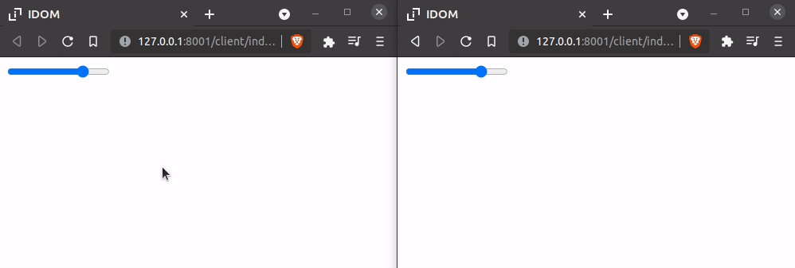
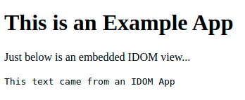

Running IDOM
============

The simplest way to run IDOM is with the :func:`~idom.server.prefab.run` function. By
default this will execute your application using one of the builtin server
implementations whose dependencies have all been installed. Running a tiny "hello world"
application just requires the following code:

.. example:: hello_world
    :activate-result:

.. note::

    Try clicking the **▶️ Result** tab to see what this displays!

Running IDOM in Debug Mode
--------------------------

IDOM provides a debug mode that is turned off by default. This can be enabled when you
run your application by setting the ``IDOM_DEBUG_MODE`` environment variable.

.. tab-set::

    .. tab-item:: Unix Shell

        .. code-block::

            export IDOM_DEBUG_MODE=1
            python my_idom_app.py

    .. tab-item:: Command Prompt

        .. code-block:: text

            set IDOM_DEBUG_MODE=1
            python my_idom_app.py

    .. tab-item:: PowerShell

        .. code-block:: powershell

            $env:IDOM_DEBUG_MODE = "1"
            python my_idom_app.py

.. dropdown:: Turn debug mode off in production!
    :color: danger
    :animate: fade-in

    Turning on ``IDOM_DEBUG_MODE`` will:

    - leak secrets
    - display error messages to your users
    - add extra checks that slow down your app

Among other things, running in this mode:

- Turns on debug log messages
- Adds checks to ensure the :ref:`VDOM` spec is adhered to
- Displays error messages that occur within your app

Errors will be displayed where the uppermost component is located in the view:

.. example:: debug_error_example
    :activate-result:

Choosing a Server Implementation
--------------------------------

Without extra care, running an IDOM app with the ``run()`` function can be somewhat
inpredictable since the kind of server being used by default depends on what gets
discovered first. To be more explicit about which server implementation you want to run
with you can import your chosen server class and pass it to the ``server_type``
parameter of ``run()``:

.. code-block::

    from idom import component, html, run
    from idom.server.sanic import PerClientStateServer

    @component
    def App():
        return html.h1(f"Hello, World!")

    run(App, server_type=PerClientStateServer)

Presently IDOM's core library supports the following server implementations:

- :mod:`idom.server.fastapi`
- :mod:`idom.server.sanic`
- :mod:`idom.server.flask`
- :mod:`idom.server.tornado`

.. note::

    To install them, see the ref:`Installing Other Servers` section.

Available Server Types
----------------------

Some of server implementations have more than one server type available. The server type
which exists for all implementations is the ``PerClientStateServer``. This server type
displays a unique view to each user who visits the site. For those that support it,
there may also be a ``SharedClientStateServer`` available. This server type presents the
same view to all users who visit the site. For example, if you were to run the following
code:

.. code-block::

    from idom import component, hooks, html, run
    from idom.server.sanic import SharedClientStateServer

    @component
    def Slider():
        value, set_value = hooks.use_state(50)
        return html.input({"type": "range", "min": 1, "max": 100, "value": value})

    run(Slider, server_type=SharedClientStateServer)

Two clients could see the slider and see a synchronized view of it. That is, when one
client moved the slider, the other would see the slider update without their action.
This might look similar to the video below:

Presently the following server implementations support the ``SharedClientStateServer``:

- :func:`idom.server.fastapi.SharedClientStateServer`
- :func:`idom.server.sanic.SharedClientStateServer`

Common Server Settings
----------------------

Each server implementation has its own high-level settings that are defined by its
respective ``Config`` (a typed dictionary). As a general rule, these ``Config`` types
expose the same options across implementations. These configuration dictionaries can
then be passed to the ``run()`` function via the ``config`` parameter:

.. code-block::

    from idom import run, component, html
    from idom.server.sanic import PerClientStateServer, Config

    @component
    def App():
        return html.h1(f"Hello, World!")

    server_config = Config(
        cors=False,
        url_prefix="",
        serve_static_files=True,
        redirect_root_to_index=True,
    )

    run(App, server_type=PerClientStateServer, config=server_config)

Here's the list of available configuration types:

- :class:`idom.server.fastapi.Config`
- :class:`idom.server.sanic.Config`
- :class:`idom.server.flask.Config`
- :class:`idom.server.tornado.Config`

Specific Server Settings
------------------------

The ``Config`` :ref:`described above <Configuring Server Settings` is meant to be an
implementation agnostic - all ``Config`` objects support a similar set of options.
However, there are inevitably cases where you need to set up your chosen server using
implementation specific details. For example, you might want to add an extra route to
the server your using in order to provide extra resources to your application.

Doing this kind of set up can be achieved by passing in an instance of your chosen
server implementation into the ``app`` parameter of the ``run()`` function. For example,
if I'm making my application with ``sanic`` and I want to add an extra route I would
do the following:

.. code-block::

    from sanic import Sanic
    from idom import component, html, run
    from idom.server.sanic import PerClientStateServer

    app = Sanic(__name__)

    # these are implementation specific settings only known to `sanic` servers
    app.config.REQUEST_TIMEOUT = 60
    app.config.RESPONSE_TIMEOUT = 60

    @component
    def SomeView():
        return html.form({"action": })

    run(SomeView, server_type=PerClientStateServer, app=app)

Add to an Existing Web Server
-----------------------------

If you're already serving an application with one of the supported web servers listed
above, you can add an IDOM to them as a server extension. Instead of using the ``run()``
function, you'll instantiate one of IDOM's server implementations by passing it an
instance of your existing application:

.. code-block::

    from sanic import Sanic

    from idom import component, html
    from idom.server.sanic import PerClientStateServer, Config

    existing_app = Sanic(__name__)

    @component
    def IdomView():
        return html.h1("This is an IDOM App")

    PerClientStateServer(IdomView, app=existing_app, config=Config(url_prefix="app"))

    existing_app.run(host="127.0.0.1", port=8000)

To test that everything is working, you should be able to navigate to
``https://127.0.0.1:8000/app`` where you should see the results from ``IdomView``.

Embed in an Existing Webpage
----------------------------

IDOM provides a Javascript client called ``idom-client-react`` that can be used to embed
IDOM views within an existing applications. This is actually how the interactive
examples throughout this documentation have been created. You can try this out by
embedding one the examples from this documentation into your own webpage:

.. tab-set::

    .. tab-item:: HTML

        .. literalinclude:: _static/embed-doc-ex.html
            :language: html

    .. tab-item:: ▶️ Result

        .. raw:: html
            :file: _static/embed-doc-ex.html

.. note::

    For more information on how to use the client see the :ref:`Javascript API`
    reference.

As mentioned though, this is connecting to the server that is hosting this
documentation. If you want to connect to a view from your own server, you'll need to
change the URL above to one you provide. One way to do this might be to :ref:`add IDOM
to your existing python web server`. Another would be to run IDOM in adjacent web server
instance that you coordinate with something like `NGINX <https://www.nginx.com/>`__. For
the sake of simplicity, we'll assume you do something similar to the following in an
existing Python app:

.. tab-set::

    .. tab-item:: main.py

        .. literalinclude:: _static/embed-idom-view/main.py
            :language: python

    .. tab-item:: index.html

        .. literalinclude:: _static/embed-idom-view/index.html
            :language: html

After running ``python main.py``, you should be able to navigate to
``http://127.0.0.1:8000/index.html`` and see:

