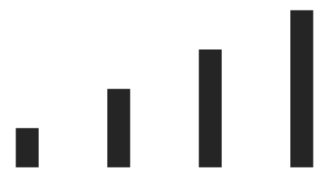
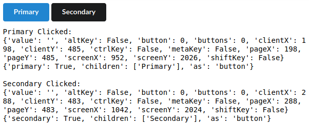
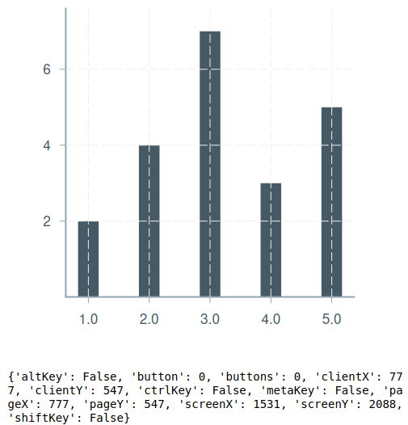

Javascript Modules
==================

.. note::

    This is recent feature of IDOM. If you have a problem following this tutorial
    `post an issue <https://github.com/rmorshea/idom/issues>`__.

While IDOM is a great tool for displaying HTML and respond to browser events with
pure Python, there are other projects which already allow you to do this inside
`Jupyter Notebooks <https://ipywidgets.readthedocs.io/en/latest/examples/Widget%20Basics.html>`__
or in
`webpages <https://blog.jupyter.org/and-voil%C3%A0-f6a2c08a4a93?gi=54b835a2fcce>`__.
The real power of IDOM comes from its ability to seemlessly leverage the existing
ecosystem of
`React components <https://reactjs.org/docs/components-and-props.html>`__.
So long as your library of interest is an
`ES Module <https://hacks.mozilla.org/2018/03/es-modules-a-cartoon-deep-dive/>`__
you could install using
`Snowpack <https://www.snowpack.dev/>`__
you can use it with IDOM (we're working to support non-standard packages too) [GH-166]_.
You can even define your own Javascript modules which use these third party Javascript
packages.

Installing React Components
---------------------------

.. note::

    - Be sure that you've installed `npm <https://www.npmjs.com/get-npm>`__.

    - We're assuming the presence of a :ref:`Display Function` for our examples.

Once you've done this you can get started right away. In this example we'll be using a
charting library for React called `Victory <https://formidable.com/open-source/victory/>`__.
Installing it in IDOM is quite simple. Just create a :class:`~idom.widgets.utils.Module`,
tell it what to install and specify ``install=True`` (we're working on a CLI for this) [GH-167]_:

.. code-block::

    import idom
    # this may take a minute to download and install
    victory = idom.Module(name="victory", install=True)

You can install a specific version using ``install="victory@34.1.3`` or any other
standard javascript dependency specifier. Alternatively, if you need to access a module
in a subfolder of your desired Javascript package, you can provide ``name="path/to/module"``
and ``install"my-package"``.

With that out of the way can import a component from Victory:

.. code-block::

    VictoryBar = victory.Import("VictoryBar")

Using the ``VictoryBar`` chart component is as simple as displaying it:

.. code-block::

    display(VictoryBar)

The output should look something like this:

Passing Props To Components
---------------------------

So now that we can install and display a dependency we probably want to pass data or
callbacks to it. This can be done in just the same way as you learned to do when
:ref:`getting started`. In the following example we'll be using a
`Button <https://react.semantic-ui.com/elements/button/>`__
component from the
`Semantic UI <https://react.semantic-ui.com/>`__
framework. We'll register callbacks and pass props to the ``<Button/>`` just as you
would for any other element in IDOM:

.. code-block::

    import idom

    semantic_ui = idom.Module("semantic-ui-react", install=True)
    Button = semantic_ui.Import("Button")

    semantic_ui_style = idom.html.link(
        {
            "rel": "stylesheet",
            "href": "//cdn.jsdelivr.net/npm/semantic-ui@2.4.2/dist/semantic.min.css",
        }
    )

    @idom.element
    async def PrimarySecondaryButtons(self):

        async def on_click_primary(event, info):
            print("Primary Clicked:")
            print(event)
            print(info)

        async def on_click_secondary(event, info):
            print("Secondary Clicked:")
            print(event)
            print(info)

        return idom.html.div(
            [
                semantic_ui_style,
                Button({"primary": True, "onClick": on_click_primary}, ["Primary"]),
                Button({"secondary": True, "onClick": on_click_secondary}, ["Secondary"]),
            ]
        )

    display(PrimarySecondaryButtons)

Which should produce the following output when interacted with:

Defining Your Own Modules
-------------------------

While it's probably best to create
`a real package <https://docs.npmjs.com/packages-and-modules/contributing-packages-to-the-registry>`__
for your Javascript, if you're just experimenting it might be easiest to just quickly
hook in a module of your own making on the fly. As before, we'll be using a
:class:`~idom.widgets.utils.Module`, however this time we'll pass it a ``source``
parameter which is a file-like object. In this example we'll use Victory again, but
this time we'll add a callback to it. Unfortunately we can't just pass it in
:ref:`like we did before <Passing Props To Components>` because Victory's event API
is a bit more complex so we've implemented a quick wrapper for it in a file ``chart.js``.

.. code-block:: javascript

    import React from "./react.js";
    import { VictoryBar, VictoryChart, VictoryTheme, Bar } from "./victory.js";
    import htm from "./htm.js";

    const html = htm.bind(React.createElement);

    export default {
      ClickableChart: function ClickableChart(props) {
        return html`
          <${VictoryChart}
            theme=${VictoryTheme.material}
            style=${{"style": {"parent": {"width": "500px"}}}}
            domainPadding=${20}
          >
            <${VictoryBar}
              data=${props.data}
              dataComponent=${html`
                <${Bar}
                  events=${{
                    onClick: props.onClick,
                  }}
                />
              `}
            />
          <//>
        `;
      },
    };

Which we can read in as a ``source`` to :class:`~idom.widgets.utils.Module`:

.. code-block::

    with open("chart.js") as f:
        ClickableChart = idom.Module("chart", source=f).Import("ClickableChart")

    async def handle_event(event):
        print(event)

    data = [
        {"x": 1, "y": 2},
        {"x": 2, "y": 4},
        {"x": 3, "y": 7},
        {"x": 4, "y": 3},
        {"x": 5, "y": 5},
    ]

    display(
        ClickableChart,
        {"data": data, "onClick": handle_event}
    )

The above usag should then produce the following output when you click the bars in the chart:

